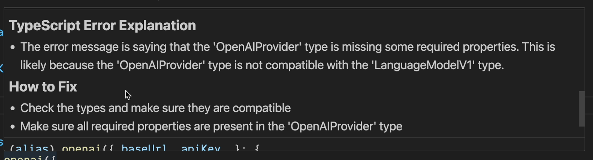

# Pretty TypeScript Errors Plus 🪄

A VS Code extension that enhances TypeScript error messages with AI-powered explanations and solutions. Get clear, human-friendly explanations for complex TypeScript errors right in your editor.

## Features

- 🤖 **AI-Powered Error Explanations**: Hover over TypeScript errors to get clear, detailed explanations of what went wrong
- 🛠️ **Fix Suggestions**: Each error comes with practical suggestions on how to fix the issue
- 🎯 **TypeScript & TSX Support**: Works with both TypeScript (.ts) and TypeScript React (.tsx) files
- 🔒 **Secure**: Uses your own API key for all AI operations
- 🔄 **Flexible AI Provider Support**: Compatible with OpenAI and any OpenAI-compatible API endpoints (like Groq)

## Requirements

- VS Code version 1.60.0 or higher
- An API key from OpenAI or any OpenAI-compatible provider (Groq recommended with LLAMA models)

## Setup

1. Install the extension from the VS Code marketplace
2. Configure your AI credentials:
   - Open the command palette (Cmd/Ctrl + Shift + P)
   - Search for "Pretty TypeScript Errors: Set Credentials"
   - Enter your API key when prompted
   - (Optional) Set a custom base URL if using an alternative provider like Groq

## Extension Settings

This extension contributes the following settings:

- `prettyTypeScriptErrorsPlus.model`: The AI model to use for error explanations (supports OpenAI models and LLAMA models via Groq)
- `prettyTypeScriptErrorsPlus.baseUrl`: Custom API base URL (use this to switch to Groq or other OpenAI-compatible providers)

## How It Works

1. When you hover over a TypeScript error in your code, the extension captures the error message and code
2. It sends this information to OpenAI's API to generate a clear explanation and potential fixes
3. The response is displayed in a hover card with:
   - A clear explanation of what caused the error
   - Step-by-step suggestions on how to fix it

## Privacy & Security

- Your code is never stored or logged
- API calls are made using your personal API key
- All processing happens on your machine and OpenAI's servers

## Known Issues

Please report any issues on our GitHub repository.

## Contributing

Contributions are welcome! Please feel free to submit a Pull Request.

## License

This extension is licensed under the MIT License.

---

**Enjoy coding with clearer TypeScript errors!** 🚀
